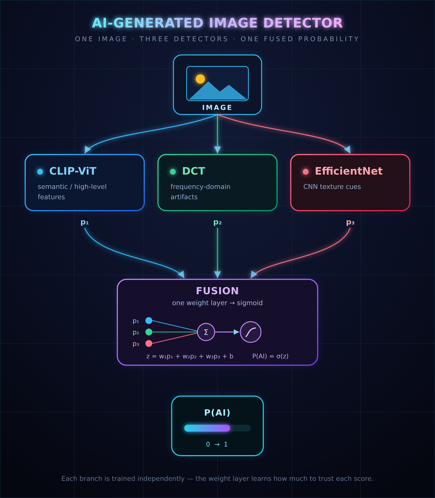

# starting5: Robust AI Image Detector for TechJam26

A prototype that scores an image with the probability it was AI-generated, built to stay accurate after the transformations images might go through on social media before a person sees them: JPEG re-compression, blur, resizing, noise, colour adjustment, and cropping.



## 1. Overview

Photographs have been doctored since their invention over a century ago. What is new now is that photos can be generated from scratch. The rise of generative AI has decreased the cost, skill and time required to make a convincing fake image, making a model that can tell real and fake images apart ever more necessary in this day and age. 

Humans are already unable to distinguish well-generated AI images from real ones: Nightingale & Farid (PNAS, 2022) found participants classified StyleGAN2 faces at 48% accuracy, which is about as accurate as coin flipping. Yet, the impact of AI images can be devastating - Deloitte projects generative-AI-enabled fraud losses in the US alone could reach $40 billion by 2027 (Deloitte, 2024). 

In the course of images being spread around, particularly on social media, artificial traces and watermarks originally present in the image can disappear. Publishing pipelines and social platforms discard metadata as a matter of course (Bray, 2025), and invisible watermarks are provably removable by a noise-then-reconstruct regeneration attack (Zhao et al., NeurIPS 2024). The consequence is that images reach a viewer only after re-encoding, resizing, screenshotting, and cropping, which would destroy the high-frequency generator fingerprints detectors often rely on. On an in-the-wild benchmark of deepfakes actually circulating in 2024, open-source image detectors lost roughly 45% of their AUC relative to academic benchmarks (Chandra et al., 2025). 

These observations tie deeply into the problem statement for TechJam 2026:
“We want participants to build a prototype that can distinguish AI-generated images from authentic images with strong robustness under realistic post-processing and redistribution scenarios. The goal is not only to achieve good detection performance on clean data, but also to maintain accuracy after transformations such as blur, compression, color adjustment, cropping, or rescaling. Solutions should present a clear technical approach, an evaluation strategy, and thoughtful discussion of trade-offs such as robustness, generalisation, and false positives.”

Most detectors are evaluated on the same clean, pristine images they were trained on, and quietly fail the moment an image is re-encoded by a messaging app or thumbnailed by a social feed. This project aims to solve the issue of the gap, hopefully making a more reliable detector, reducing the negative impact of AI images on the internet.

In the course of the challenge, the main issues we identified are:
1. Generalization
- With the development of SOTA generative models, the AIGC is getting more and more realistic.
- The visual cues that human or ML models used to depend on are disappearing.
- The invisible artifacts exhibit different patterns against prior methods.
2. Robustness
- Accuracy collapses after blur, JPEG conversion, cropping, color shifts or rescaling.
- Detecting AI-generated images is already challenging on clean data, but the real difficulty emerges after images leave the generator as in the real world, the images that move across platforms get compressed, cropped, re-save, filtered - destroying the exact signals a detector relies on. 

**Architecture — a three-branch ensemble.** Our solution addresses these challenges through a multi-modal pipeline that synthesizes insights from three distinct architectural branches — a frequency-domain DCT forensic analyzer, a semantic CLIP module, and a specialized EfficientNet pixel classifier — to produce a unified, calibrated confidence score for synthetic image detection.


| Branch | What it reads | How it works |
|---|---|---|
| **CLIP-ViT** | High-level *semantic* content | **CLIP** uses a frozen ViT-L/14 encoder with a logistic probe on top. Trained on image-text pairs rather than forgery detection, it captures scene content - the objects present and whether the composition holds together - catching the kind of error a person might notice (e.g. lighting falling the wrong way, anatomy that does not quite work). A feature space not trained end-to-end on one generator transfers to unseen generators far better than a network fine-tuned on a single dataset. |
| **DCT / frequency** | Compression & *frequency-domain* artefacts | **DCT** ignores content entirely, splitting the luminance channel into 8x8 blocks and applying the same cosine transform JPEG uses. Then, a small convolutional network (CNN) reads the resulting frequency grid alongside two forensic scores targeting the traces left by upsampling and repeated compression. Targets the low-level fingerprints CLIP is blind to. |
| **EfficientNet** | Local *texture* cues | **EfficientNet** works on the pixels in an image and learns the local texture statistics separating a camera sensor's output from a generator's.
| **Fusion head** | The three branch scores | A single weight layer plus a sigmoid: `z = w₁p₁ + w₂p₂ + w₃p₃ + b`, `P(AI) = σ(z)`. It learns how much to trust each branch. |

A network fine-tuned end-to-end on one dataset tends to treat "real" as a catch-all for anything lacking its training generator's specific artefacts, so a frozen, generically pre-trained feature space (CLIP) is the branch that stays in the ensemble unconditionally, while the narrower branches (DCT, EfficientNet) are there to complement CLIP in what it might possibly fail to detect. The information collected is never from the same place, giving the pipeline a comprehensive and pluralistic approach to detecting AI-generated images.

## 2. Repository structure

```
.
├── notebooks/
│   ├── train_clip_branch.ipynb          # CLIP ViT-L/14 + probe, robustness harness, bundle export
│   ├── train_efficientnet_branch.ipynb  # EfficientNet-B0 fine-tuning (provisional — see status note)
│   ├── final_pipeline.ipynb             # the 3-branch ensemble + fusion head (TopLayer / AIDetector)
│   └── evaluate_robustness.ipynb        # standalone eval harness: any model -> table + figures + predictions.json
├── docs/
│   ├── pipeline.png                     # the diagram at the top of this README
│   ├── robustness-evaluation-protocol.md      # design rationale for the augmentation + eval grid
│   ├── robustness-summary-and-error-analysis.md  # CLIP branch results + error analysis
│   ├── texture-crop-ood-writeup.md            # why TextureCrop degrades out-of-distribution
│   └── ensemble-branch-decision.md            # branch-inclusion decision record + integration spec
├── artifacts/
│   └── detector_bundle.joblib           # saved CLIP probe(s) + config, produced by train_clip_branch.ipynb
└── README.md
```

> File names above are the intended layout; map them to your actual notebook filenames if they differ.

`notebooks/evaluate_robustness.ipynb` is the file that satisfies the challenge's evaluation deliverables: it takes any registered detector (a CLIP bundle or any `torch.nn.Module`), runs it over the validation set under all 15 conditions from the brief, and writes `predictions.json` alongside the robustness summary table and diagnostic figures.

## 3. Setup and installation

Development runs in Google Colab (T4 GPU); the notebooks assume that environment, but the underlying code is plain PyTorch / scikit-learn and runs anywhere with a GPU.

**Dependencies**

```bash
pip install opencv-python scipy albumentations pillow numpy \
            open_clip_torch torch torchvision scikit-learn \
            timm matplotlib pandas joblib tqdm kagglehub
```

- `open_clip_torch` — loads the frozen CLIP ViT-L/14 backbone (OpenAI weights).
- `timm` — builds the EfficientNet-B0 backbone.
- `opencv-python-headless` / `scipy` — DCT computation and the TextureCrop entropy scoring (a pure-NumPy fallback runs automatically if `cv2` is missing).
- `albumentations` — the image augmentation operators.

**Data**

| Dataset | Role | Where it comes from |
|---|---|---|
| SID_Set subset (full-resolution) | Training set for the reported numbers | Subset of `https://huggingface.co/datasets/saberzl/SID_Set` |
| COCO val2017 + DALL·E 3 generations | Fixed validation set — never used for training | ModelScope (`hy2628982280/WildFake`) |
| WildFake | Cross-generator generalisation set | ModelScope (`hy2628982280/WildFake`); to train the final fusion hub and for validation purposes |

**Model checkpoints** the pipeline expects on Drive (`techjam/`): the CLIP bundle (`*.joblib`), `efficientnet_b0_detector-2.pt`, `dct_logreg.joblib`, and `dct_coeff_net.pth`. Paths are set at the top of each notebook.

## 4. Steps to reproduce

1. **Train the CLIP branch.** Open `notebooks/train_clip_branch.ipynb`, mount Drive, run all cells. This extracts CLIP features (cached to disk so a disconnect only costs the unfinished part), trains a `baseline` probe (clean views) and a `robust` probe (clean + augmented views), and exports `detector_bundle.joblib`. crop_mode can switch between center cropping(default) and texture cropping.
2. **Train the EfficientNet branch.** Open `notebooks/train_effnet_branch.ipynb`, mmount Drive, run all cells. This fine-tunes an ImageNet-pretrained EfficientNet-B0 (backbone frozen except the last block plus the head conv/classifier) on the SID_Set subset, applying one randomly-chosen transform per image at 60% probability (JPEG compression, Gaussian blur, downscale, Gaussian noise, colour jitter, or an 80% centre crop), with the remaining 40% of images passed through clean. Checkpoints on validation AUC improvement, then exports three artifacts: a raw-probabilities CSV for the fusion pipeline (efficientnet_val_probs.csv), a self-contained portable checkpoint with embedded preprocessing metadata (efficientnet_b0_detector.pt), and a TorchScript trace that runs without timm or this notebook (efficientnet_b0_detector.ts).
3. **Train the DCT branch.** Open `notebooks/train_clip_branch.ipynb`, mount Drive, run all cells. The data will run through extract_features function to return the weights, and through a logistic classification model, and exports both 'dct_logreg_model.joblib' (for the logistic classifier model) and 'dct_coeff_net.pth' (for the weights) into Drive . 
3. **Assemble the ensemble.** **TODO**
4. **Run the evaluation harness.** **TODO**
5. **Verify.** The harness's Part 8 runs self-checks automatically (clean-AUC label-convention sanity, alignment, reproducibility, completeness) and raises an assertion if anything looks wrong — a run printing "all checks passed" is the signal the numbers are trustworthy.

## 5. Evaluation protocol

- **Seperate training and test data** Training uses continuous parameter ranges that span and slightly exceed the brief's values so the model can get exposure to a wider variety of data, while the evaluation uses the problem statement's exact discrete settings. This prevents memorisation of the six numbers.
- **Seperate Human and AI accuracy**, to better evaluate a model on the augmentations.

## 6. Limitations and what we would improve given more time

### Sources
The main limitation in the project comes from where we source the data, which inadvertently contributed to a lot of the issues faced in the project. All of our project is trained under a small subset of the SID dataset, which can cause a few issues.

1. The small training set is likely not enough to get a full picture of all images on social media. This can be especially detrimental to models like the DCT, as even within a same model, different objects (e.g. cat vs dog) can create different artifacts. Hence, to combat this, the dataset should ideally contain some data/images of as many categoriees of objects as possible, to give the model a better understanding of semantic meanings or frequency data.

2. Real and AI images in both the training and validation sets differ in resolution and compression history (e.g. COCO ~640×480 vs DALL·E ~1024²), which a detector can partly exploit instead of learning genuine forensic signal. This gives it potential shortcuts which can cause it to not properly learn image details. In the future, we can canonicalise resolution and JPEG quality across both classes before scoring.

3. The AI images in the training set are not representative of AI images in the wild now. ALL AI images generated in the SID set are generated by the same generator, which means the fingerprints are all localised to the one generator. This degrades performance on unseen generators, especially for ensemble agents like DCT that rely on frequency-domain statistics. In the future, we should incorporate more data from a variety of AI image generators spanning the different types (GAN, Stable Diffusion, other SOTA Agents) so the model has a better idea of different fingerprints.

## 7. Team Contribution

Zhenyuan: CLIP-VIT Code & Analysis, helped with writeup/documentation \
Amrit: DCT Code , helped with writeup/documentation \
Hong Zheng: Fusion Hub Plan B (Future Implementation), helped with writeup/ documentation \
